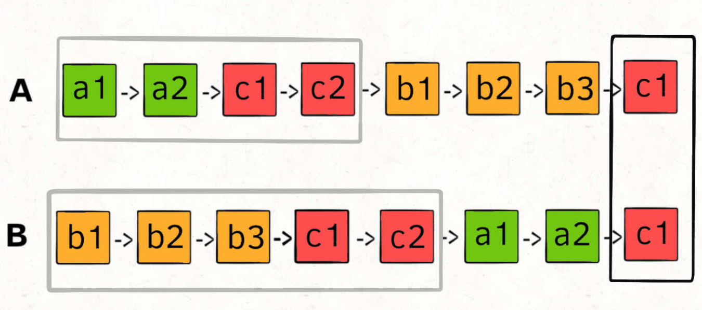

本篇文章是学习leetcode中链表相关算法总结的链表技巧。

## 虚拟头节点

### 力扣第 21 题「合并两个有序链表」

```c++
ListNode *mergeTwoLists(ListNode *l1, ListNode *l2)
{
    ListNode *head = new ListNode(-1), *p = head;
    while (l1 && l2)
    {
        if (l1->val < l2->val)
        {
            p->next = l1;
            l1 = l1->next;
        }
        else
        {
            p->next = l2;
            l2 = l2->next;
        }
        p = p->next;
    }
    p->next = l1 ? l1 : l2;
    return head->next;
}
```

这个算法的逻辑类似于「拉拉链」，`l1, l2` 类似于拉链两侧的锯齿，指针 `p` 就好像拉链的拉索，将两个有序链表合并

`ListNode *head = new ListNode(-1), *p = head;`中使用到了虚拟头节点，如果不使用虚拟节点，代码会复杂很多，而有了 `head` 节点这个占位符，可以避免处理空指针的情况，降低代码的复杂性

## 优先队列

### 力扣第 23 题「合并K个升序链表」

```c++
struct cmp
{
    bool operator()(ListNode *p1, ListNode *p2)
    {
        return p1->val > p2->val;
    }
};

ListNode *mergeKLists(vector<ListNode *> &lists)
{
    if (lists.size() == 0)
        return nullptr;
    ListNode *head = new ListNode(-1), *tail = head;
    priority_queue<ListNode *, vector<ListNode *>, cmp> pq;
    for (auto i : lists)
    {
        if (i)
            pq.push(i);
    }
    while (!pq.empty())
    {
        ListNode *node = pq.top();
        pq.pop();
        tail->next = node;
        tail = tail->next;
        if (node->next)
            pq.push(node->next);
    }
    return head->next;
}
```

这里我们就要用到 **优先级队列** 这种数据结构，把链表节点放入一个最小堆，就可以每次获得 `k` 个节点中的最小节点

它的时间复杂度是多少呢？

优先队列 `pq` 中的元素个数最多是 `k`，所以一次 `poll` 或者 `add` 方法的时间复杂度是 `O(logk)`；所有的链表节点都会被加入和弹出 `pq`，**所以算法整体的时间复杂度是 `O(Nlogk)`，其中 `k` 是链表的条数，`N` 是这些链表的节点总数**。

## 单链表的倒数第k个节点

### 力扣第 19 题「删除链表的倒数第 N 个结点」

```c++
ListNode *removeNthFromEnd(ListNode *head, int n)
{
    ListNode *dummy = new ListNode(-1);
    dummy->next = head;

    auto temp = FindFromEnd(dummy, n + 1);

    temp->next = temp->next->next;

    return dummy->next;
}
ListNode *FindFromEnd(ListNode *head, int n)
{
    ListNode *first = head, *second = head;
    while (n--)
    {
        first = first->next;
    }
    while (first)
    {
        first = first->next;
        second = second->next;
    }
    return second;
}
```

1. 首先，我们先让一个指针 `p1` 指向链表的头节点 `head`，然后走 `k` 步
2. 现在的 `p1`，只要再走 `n - k` 步，就能走到链表末尾的空指针了对吧？趁这个时候，再用一个指针 `p2` 指向链表头节点 `head`
3. 接下来就很显然了，让 `p1` 和 `p2` 同时向前走，`p1` 走到链表末尾的空指针时走了 `n - k` 步，`p2` 也走了 `n - k` 步，也就是链表的倒数第 `k` 个节点
4. 这样，只遍历了一次链表，就获得了倒数第 `k` 个节点 `p2`

不过注意我们又使用了虚拟头结点的技巧，也是为了防止出现空指针的情况，比如说链表总共有 5 个节点，题目就让你删除倒数第 5 个节点，也就是第一个节点，那按照算法逻辑，应该首先找到倒数第 6 个节点。但第一个节点前面已经没有节点了，这就会出错。

但有了我们虚拟节点 `dummy` 的存在，就避免了这个问题，能够对这种情况进行正确的删除。

## 双指针

### 力扣第 876 题「链表的中间结点」

如果想一次遍历就得到中间节点，也需要耍点小聪明，使用「快慢指针」的技巧：

我们让两个指针 `slow` 和 `fast` 分别指向链表头结点 `head`。

**每当慢指针 `slow` 前进一步，快指针 `fast` 就前进两步，这样，当 `fast` 走到链表末尾时，`slow` 就指向了链表中点**。

```c++
ListNode *middleNode(ListNode *head)
{
    ListNode *slow = head, *fast = head;
    while (fast && fast->next)
    {
        slow = slow->next;
        fast = fast->next->next;
    }
    return slow;
}
```

### 力扣第 141 题「环形链表」

判断链表是否包含环属于经典问题了，解决方案也是用快慢指针：

每当慢指针 `slow` 前进一步，快指针 `fast` 就前进两步。

如果 `fast` 最终遇到空指针，说明链表中没有环；如果 `fast` 最终和 `slow` 相遇，那肯定是 `fast` 超过了 `slow` 一圈，说明链表中含有环。

```c++
bool hasCycle(ListNode *head)
{
    ListNode *slow = head, *fast = head;
    while (fast && fast->next)
    {
        slow = slow->next;
        fast = fast->next->next;
        if (slow == fast)
            return true;
    }
    return false;
}
```

当然，这个问题还有进阶版：如果链表中含有环，如何计算这个环的起点？

这里简单提一下解法：

```java
ListNode detectCycle(ListNode head) {
    ListNode fast, slow;
    fast = slow = head;
    while (fast != null && fast.next != null) {
        fast = fast.next.next;
        slow = slow.next;
        if (fast == slow) break;
    }
    // 上面的代码类似 hasCycle 函数
    if (fast == null || fast.next == null) {
        // fast 遇到空指针说明没有环
        return null;
    }

    // 重新指向头结点
    slow = head;
    // 快慢指针同步前进，相交点就是环起点
    while (slow != fast) {
        fast = fast.next;
        slow = slow.next;
    }
    return slow;
}
```

### 力扣第 160 题「相交链表」

```c++
ListNode *getIntersectionNode(ListNode *headA, ListNode *headB)
{
    ListNode *A = headA, *B = headB;
    while (A != B)
    {
        if (A)
            A = A->next;
        else
            A = headB;
        if (B)
            B = B->next;
        else
            B = headA;
    }
    return A;
}
```

如果用两个指针 `p1` 和 `p2` 分别在两条链表上前进，并不能**同时**走到公共节点，也就无法得到相交节点 `c1`。

**解决这个问题的关键是，通过某些方式，让 `p1` 和 `p2` 能够同时到达相交节点 `c1`**。

所以，我们可以让 `p1` 遍历完链表 `A` 之后开始遍历链表 `B`，让 `p2` 遍历完链表 `B` 之后开始遍历链表 `A`，这样相当于「逻辑上」两条链表接在了一起。

如果这样进行拼接，就可以让 `p1` 和 `p2` 同时进入公共部分，也就是同时到达相交节点 `c1`：



那你可能会问，如果说两个链表没有相交点，是否能够正确的返回 null 呢？

这个逻辑可以覆盖这种情况的，相当于 `c1` 节点是 null 空指针嘛，可以正确返回 null。

这样，这道题就解决了，空间复杂度为 `O(1)`，时间复杂度为 `O(N)`。