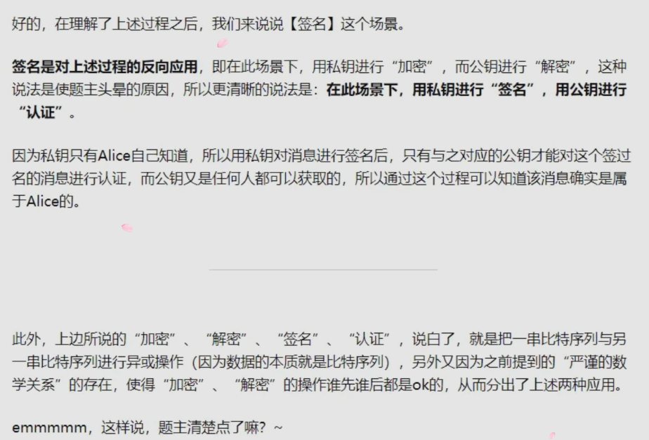

本文为 `dynamic-datasource-spring-boot-starter` （基于SpringBoot的快速集成多数据源框架）的使用文档。

# 特性

1. 支持 `数据源分组` ，适用于多种场景，纯粹多库、读写分离、一主多从、混合模式。
2. 支持数据库敏感配置信息 `加密(可自定义)` ENC()。
3. 支持每个数据库独立初始化表结构schema和数据库database。
4. 支持无数据源启动，支持 `懒加载数据源` （需要的时候再创建连接）。
5. 支持 `自定义注解` ，需继承DS(3.2.0+)。
6. 提供并简化对Druid，HikariCp，BeeCp，Dbcp2的快速集成。
7. 提供对 `Mybatis-Plus` ，Quartz，ShardingJdbc，P6sy，Jndi等组件的集成方案。
8. 提供 `自定义数据源来源` 方案（如全从数据库加载）。
9. 提供项目启动后 `动态增加移除数据源` 方案。
10. 提供Mybatis环境下的 `纯读写分离` 方案。
11. 提供使用 `spel动态参数` 解析数据源方案。内置spel，session，header，支持自定义。
12. 支持 `多层数据源嵌套切换` 。（ServiceA >>> ServiceB >>> ServiceC）。
13. 提供 `基于seata的分布式事务方案` 。
14. 提供 `本地多数据源事务方案` 。

# 约定

1. dynamic-datasource只做 `切换数据源` 这件核心的事情，并 `不限制你的具体操作` ，切换了数据源可以做任何CRUD。
2. 配置文件所有以下划线 `_` 分割的数据源 `首部` 即为组的名称，相同组名称的数据源会放在一个组下。
3. 切换数据源可以是组名，也可以是具体数据源名称。 `组名则切换时采用负载均衡算法切换` 。
4. 默认的数据源名称为 `master` ，你可以通过 `spring.datasource.dynamic.primary` 修改。
5. `方法上的注解优先于类上注解`。
6. DS支持继承抽象类上的DS，暂不支持继承接口上的DS。

# 使用方法

1. 引入dynamic-datasource-spring-boot-starter

spring-boot 1.5.x、2.x.x
```xml
<dependency>
  <groupId>com.baomidou</groupId>
  <artifactId>dynamic-datasource-spring-boot-starter</artifactId>
  <version>${version}</version>
</dependency>
```

spring-boot3及以上
```xml
<dependency>
  <groupId>com.baomidou</groupId>
  <artifactId>dynamic-datasource-spring-boot3-starter</artifactId>
  <version>${version}</version>
</dependency>
```

2. 配置数据源

```yaml
spring:
  datasource:
    dynamic:
      primary: master # 设置默认的数据源或者数据源组,默认值即为master
      strict: false # 严格匹配数据源,默认false. true未匹配到指定数据源时抛异常,false使用默认数据源
      datasource:
        master:
          url: jdbc:mysql://xx.xx.xx.xx:3306/dynamic
          username: root
          password: 123456
          driver-class-name: com.mysql.cj.jdbc.Driver # 3.2.0开始支持SPI可省略此配置
        slave_1:
          url: jdbc:mysql://xx.xx.xx.xx:3307/dynamic
          username: root
          password: 123456
          driver-class-name: com.mysql.cj.jdbc.Driver
        slave_2:
          url: ENC(xxxxx) # 内置加密,使用请查看详细文档
          username: ENC(xxxxx)
          password: ENC(xxxxx)
          driver-class-name: com.mysql.cj.jdbc.Driver
       # ......省略
       # 以上会配置一个默认库master，一个组slave下有两个子库slave_1,slave_2
```

```yaml
# 多主多从
spring:
  datasource:
    dynamic:
      datasource:
        master_1:
        master_2:
        slave_1:
        slave_2:
        slave_3:
```

```yaml
# 纯粹多库（记得设置primary）
spring:
  datasource:
    dynamic:
      datasource:
        mysql:
        oracle:
        sqlserver:
        postgresql:
        h2:
```

```yaml
# 混合配置
spring:
  datasource:
    dynamic:
      datasource:
        master:
        slave_1:
        slave_2:
        oracle_1:
        oracle_2:
```

3. 使用 `@DS` 切换数据源

`@DS` 可以注解在方法上或类上，同时存在 `就近原则`，`方法上注解` 优先于 `类上注解`。

| 注解 | 结果  |
| :---: | :---: |
| 没有@DS | 默认数据源  |
| @DS("dsName") | dsName可以为组名也可以为具体某个库的名称，组名则切换时采用负载均衡算法切换  |

```java
@Service
@DS("slave")
public class UserServiceImpl implements UserService {

  @Autowired
  private JdbcTemplate jdbcTemplate;

  // 使用slave数据源
  public List selectAll() {
    return  jdbcTemplate.queryForList("select * from user");
  }

  // 使用slave_1数据源
  @Override
  @DS("slave_1")
  public List selectByCondition() {
    return  jdbcTemplate.queryForList("select * from user where age >10");
  }
}
```

# DS放在哪里合适

DS作为切换数据源核心注解，我应该把他注解在哪里合适？

这其实是初次接触多数据源的人常问的问题。

这其实没有一定的要求，只是有一些经验之谈。

首先开发者要了解的基础知识是，DS注解是基于AOP的原理实现的，aop的常见失效场景应清楚，比如内部调用失效，shiro代理失效。

`通常建议DS放在serviceImpl的方法上，如事务注解一样。`

- 注解在Controller的方法上或类上

并不是不可以，作者并不建议的原因主要是controller主要作用是参数的检验等一些基础逻辑的处理，这部分操作常常并不涉及数据库。

- 注解在service的实现类的方法或类上

这是作者建议的方式，service主要是对业务的处理， 在复杂的场景涉及连续切换不同的数据库。

如果你的方法有通用性，其他service也会调用你的方法。 这样别人就不用重复处理切换数据源。

- 注解在Mapper上

通常如果你某个Mapper对应的表只在确定的一个库，也是可以的，但是建议只注解在Mapper的类上。

我之前出现多线程失效场景的时候，就是在Mapper上加了注解解决的。

- 其他使用方式

**继承抽象类上的DS**

比如我有一个抽象Service，我想实现继承我这个抽象Service下的子Service的所有方法除非重新指定，都用我抽象Service上注解的数据源。是否支持？

答：支持。

**继承接口上的DS**

3.4.1开始支持， 但是需要注意的是，一个类能实现多个接口，如果多个接口都有DS会如何？

不知道，别这么干。一般不会有人这么干吧，想一想都知道会出问题。

# 连接池集成

传统多数据源集成连接池如果需要配置的参数较多，则手动编码量大，编程复杂。

dynamic-datasource实现了常见数据源的参数配置，支持全局配置每个数据源继承。

通过本章您可以快速掌握不同连接池的集成配置方案和继承中可能遇见的问题。

## 连接池必读

1. 每个数据源都有一个type来指定连接池。

2. 每个数据源甚至可以使用不同的连接池，如无特殊需要并不建议。

3. type 不是必填字段。

在没有设置type的时候系统会自动按以下顺序查找并使用连接池：

Druid > HikariCp > BeeCp > DBCP2 > Spring Basic。

```yaml
spring:
  datasource:
    dynamic:
      primary: db1
      datasource:
        db1:
          url: jdbc:mysql://xx.xx.xx.xx:3306/dynamic
          username: root
          password: 123456
          driver-class-name: com.mysql.cj.jdbc.Driver
          type: com.zaxxer.hikari.HikariDataSource     # 使用Hikaricp
        db2:
          url: jdbc:mysql://xx.xx.xx.xx:3307/dynamic
          username: root
          password: 123456
          driver-class-name: com.mysql.cj.jdbc.Driver
          type: com.alibaba.druid.pool.DruidDataSource # 使用Druid
        db3:
          url: jdbc:mysql://xx.xx.xx.xx:3308/dynamic
          username: root
          password: 123456
          driver-class-name: com.mysql.cj.jdbc.Driver
          type: cn.beecp.BeeDataSource                 # 使用beecp

```

## 集成Druid

### 基础介绍

Druid Github：[点我跳转](https://github.com/alibaba/druid)

Druid 文档：[点我跳转](https://github.com/alibaba/druid/wiki/%E9%A6%96%E9%A1%B5)

dynamic-datasource能`简单高效`完成对Druid的集成并完成其参数的多元化配置。

各个库可以使用不同的数据库连接池，如 `master使用Druid，slave使用HikariCP`。

如果项目同时存在Druid和HikariCP并且未配置连接池type类型，`默认Druid优先于HikariCP`。

### 集成步骤

1、项目引入 `druid-spring-boot-starter` 依赖

```xml
<dependency>
    <groupId>com.alibaba</groupId>
    <artifactId>druid-spring-boot-starter</artifactId>
    <version>${version}</version>
</dependency>
```

2、排除原生Druid的快速配置类

注意：`v3.3.3及以上` 版本不用排除了。

```java
@SpringBootApplication(exclude = DruidDataSourceAutoConfigure.class)
public class Application {

  public static void main(String[] args) {
    SpringApplication.run(Application.class, args);
  }

}
```

某些SpringBoot的版本上面可能无法排除可用以下方式排除。

```yaml
spring:
  autoconfigure:
    exclude: com.alibaba.druid.spring.boot.autoconfigure.DruidDataSourceAutoConfigure
```

3、参数配置

1. 如果参数都未配置，则保持原组件默认值。
2. 如果配置了全局参数，则每一个数据源都会继承对应参数。
3. 每一个数据源可以单独设置参数覆盖全局参数。

```yaml
spring:
  datasource:
    druid:
      stat-view-servlet:
        enabled: true
        loginUsername: admin
        loginPassword: 123456
    dynamic:
      druid: # 以下是支持的全局默认值
        initial-size:
        max-active:
        min-idle:
        max-wait:
        time-between-eviction-runs-millis:
        time-between-log-stats-millis:
        stat-sqlmax-size:
        min-evictable-idle-time-millis:
        max-evictable-idle-time-millis:
        test-while-idle:
        test-on-borrow:
        test-on-return:
        validation-query:
        validation-query-timeout:
        use-global-datasource-stat:
        async-init:
        clear-filters-enable:
        reset-stat-enable:
        not-full-timeout-retry-count:
        max-wait-thread-count:
        fail-fast:
        phyTimeout-millis:
        keep-alive:
        pool-prepared-statements:
        init-variants:
        init-global-variants:
        use-unfair-lock:
        kill-when-socket-read-timeout:
        connection-properties:
        max-pool-prepared-statement-per-connection-size:
        init-connection-sqls:
        share-prepared-statements:
        connection-errorretry-attempts:
        break-after-acquire-failure:
        filters: stat # 注意这个值和druid原生不一致，默认启动了stat
        wall:
            noneBaseStatementAllow:
            callAllow:
            selectAllow:
            selectIntoAllow:
            selectIntoOutfileAllow:
            selectWhereAlwayTrueCheck:
            selectHavingAlwayTrueCheck:
            selectUnionCheck:
            selectMinusCheck:
            selectExceptCheck:
            selectIntersectCheck:
            createTableAllow:
            dropTableAllow:
            alterTableAllow:
            renameTableAllow:
            hintAllow:
            lockTableAllow:
            startTransactionAllow:
            blockAllow:
            conditionAndAlwayTrueAllow:
            conditionAndAlwayFalseAllow:
            conditionDoubleConstAllow:
            conditionLikeTrueAllow:
            selectAllColumnAllow:
            deleteAllow:
            deleteWhereAlwayTrueCheck:
            deleteWhereNoneCheck:
            updateAllow:
            updateWhereAlayTrueCheck:
            updateWhereNoneCheck:
            insertAllow:
            mergeAllow:
            minusAllow:
            intersectAllow:
            replaceAllow:
            setAllow:
            commitAllow:
            rollbackAllow:
            useAllow:
            multiStatementAllow:
            truncateAllow:
            commentAllow:
            strictSyntaxCheck:
            constArithmeticAllow:
            limitZeroAllow:
            describeAllow:
            showAllow:
            schemaCheck:
            tableCheck:
            functionCheck:
            objectCheck:
            variantCheck:
            mustParameterized:
            doPrivilegedAllow:
            dir:
            tenantTablePattern:
            tenantColumn:
            wrapAllow:
            metadataAllow:
            conditionOpXorAllow:
            conditionOpBitwseAllow:
            caseConditionConstAllow:
            completeInsertValuesCheck:
            insertValuesCheckSize:
            selectLimit:
        stat:
          merge-sql:
          log-slow-sql:
          slow-sql-millis:
      datasource:
        master:
          username: root
          password: 123456
          driver-class-name: com.mysql.cj.jdbc.Driver
          url: jdbc:mysql://xx.xx.xx.xx:3306/dynamic?characterEncoding=utf8&useSSL=false
          druid: # 以下是独立参数，每个库可以重新设置
            initial-size: 20
            validation-query: select 1 FROM DUAL # 比如oracle就需要重新设置这个
            public-key: #（非全局参数）设置即表示启用加密,底层会自动帮你配置相关的连接参数和filter，推荐使用本项目自带的加密方法。

```

以下是我曾经配置过的示例：
```yaml
# 数据源配置
spring:
    # 排除掉druid原生的自动配置
    autoconfigure:
        exclude: com.alibaba.druid.spring.boot.autoconfigure.DruidDataSourceAutoConfigure
    datasource:
    	druid:
            # 初始连接数
			initialSize: 5
			# 最小连接池数量
			minIdle: 10
			# 最大连接池数量
			maxActive: 20
			# 配置获取连接等待超时的时间
			maxWait: 60000
			# 配置连接超时时间
			connectTimeout: 30000
			# 配置网络超时时间
			socketTimeout: 60000
			# 配置间隔多久才进行一次检测，检测需要关闭的空闲连接，单位是毫秒
			timeBetweenEvictionRunsMillis: 60000
			# 配置一个连接在池中最小生存的时间，单位是毫秒
			minEvictableIdleTimeMillis: 300000
			# 配置一个连接在池中最大生存的时间，单位是毫秒
			maxEvictableIdleTimeMillis: 900000
			# 配置检测连接是否有效
			validationQuery: SELECT 1 FROM DUAL
			testWhileIdle: true
			testOnBorrow: false
			testOnReturn: false
			webStatFilter:
				enabled: true
			statViewServlet:
				enabled: true
				# 设置白名单，不填则允许所有访问
				allow:
				url-pattern: /druid/*
				# 控制台管理用户名和密码
				login-username: admin
				login-password: 123456
			filter:
				stat:
					enabled: true
					# 慢SQL记录
					log-slow-sql: true
					slow-sql-millis: 2000
					merge-sql: true
				wall:
					config:
						multi-statement-allow: true
        dynamic:
            druid:
                # 初始连接数
                initial-size: 5
                # 最小连接池数量
                min-idle: 10
                # 最大连接池数量
                max-active: 20
                # 配置获取连接等待超时的时间
                max-wait: 60000
                # 配置间隔多久才进行一次检测，检测需要关闭的空闲连接，单位是毫秒
                time-between-eviction-runs-millis: 60000
                # 配置一个连接在池中最小生存的时间，单位是毫秒
                min-evictable-idle-time-millis: 300000
                # 配置一个连接在池中最大生存的时间，单位是毫秒
                max-evictable-idle-time-millis: 900000
                # 配置检测连接是否有效
                validation-query: SELECT 1 FROM DUAL
                test-while-idle: true
                test-on-borrow: false
                test-on-return: false
                # 打开PSCache，并指定每个连接上PSCache的大小。
                # oracle设为true，mysql设为false。分库分表较多推荐设置为false
                pool-prepared-statements: false
                max-pool-prepared-statement-per-connection-size: 20
                filters: stat # 注意这个值和druid原生不一致，默认启动了stat
                stat:
                  merge-sql: true
                  log-slow-sql: true
                  slow-sql-millis: 2000
            primary: master # 设置默认的数据源或者数据源组
            strict: false # 设置严格模式,默认false不启动,启动后在未匹配到指定数据源时候回抛出异常,不启动会使用默认数据源
            datasource:
                master:
                    url: jdbc:mysql://192.168.56.101:3306/master?useUnicode=true&characterEncoding=utf8&zeroDateTimeBehavior=convertToNull&useSSL=true&serverTimezone=GMT%2B8
                    username: root
                    password: root
                    driver-class-name: com.mysql.cj.jdbc.Driver
                slave_1:
                    url: jdbc:mysql://192.168.56.102:3306/slave_1?useUnicode=true&characterEncoding=utf8&zeroDateTimeBehavior=convertToNull&useSSL=true&serverTimezone=GMT%2B8&rewriteBatchedStatements=true
                    username: root
                    password: root
                    driver-class-name: com.mysql.cj.jdbc.Driver
                slave_2:
                    url: jdbc:mysql://192.168.56.103:3306/slave_2?useUnicode=true&characterEncoding=utf8&zeroDateTimeBehavior=convertToNull&useSSL=true&serverTimezone=GMT%2B8&rewriteBatchedStatements=true
                    username: root
                    password: root
                    driver-class-name: com.mysql.cj.jdbc.Driver
                    druid: # 以下参数针对每个库可以重新设置druid参数
                        initial-size:
                        validation-query: select 1 FROM DUAL # 比如oracle就需要重新设置这个
                        public-key: #（非全局参数）设置即表示启用加密,底层会自动帮你配置相关的连接参数和filter。

```

如上即可配置访问用户和密码，访问 `http://ip:端口/druid/index.html` 查看druid监控。

### 示例项目

[点我跳转](https://github.com/dynamic-datasource/dynamic-datasource-samples/tree/master/datasource-samples/druid-sample)

### 核心源码

`Druid数据源创建器`：[点我跳转](https://github.com/baomidou/dynamic-datasource/blob/master/src/main/java/com/baomidou/dynamic/datasource/creator/DruidDataSourceCreator.java)

`Druid参数源码`：[点我跳转](https://github.com/baomidou/dynamic-datasource/blob/master/src/main/java/com/baomidou/dynamic/datasource/spring/boot/autoconfigure/druid/DruidConfig.java)

## 集成HikariCP

### 基础介绍

`HikariCP Github`：[点我跳转](https://github.com/brettwooldridge/HikariCP)

`HikariCP 文档`：[点我跳转](https://github.com/brettwooldridge/HikariCP/wiki)

### 集成步骤

1、项目引入 `HikariCP` 依赖

`SpringBoot2.x.x`默认引入了HikariCP，除非对版本有要求无需再次引入。

`SpringBoot 1.5.x`需手动引入，对应的版本请根据自己环境和HikariCP官方文档自行选择。

```xml
<dependency>
    <groupId>com.zaxxer</groupId>
    <artifactId>HikariCP</artifactId>
    <version>${version}</version>
</dependency>
```

2、参数配置

1. 如果参数都未配置，则保持原组件默认值。
2. 如果配置了全局参数，则每一个数据源都会继承对应参数。
3. 每一个数据源可以单独设置参数覆盖全局参数。

特别注意，hikaricp原生设置某些字段名和dynamic-datasource不一致，dynamic-datasource是根据参数反射设置，而原生hikaricp字段名称和set名称不一致。

```yaml
spring:
  datasource:
    dynamic:
      hikari:  # 全局hikariCP参数，所有值和默认保持一致。(现已支持的参数如下,不清楚含义不要乱设置)
        catalog:
        connection-timeout:
        validation-timeout:
        idle-timeout:
        leak-detection-threshold:
        max-lifetime:
        max-pool-size:
        min-idle:
        initialization-fail-timeout:
        connection-init-sql:
        connection-test-query:
        dataSource-class-name:
        dataSource-jndi-name:
        schema:
        transaction-isolation-name:
        is-auto-commit:
        is-read-only:
        is-isolate-internal-queries:
        is-register-mbeans:
        is-allow-pool-suspension:
        data-source-properties:
        health-check-properties:
      datasource:
        master:
          username: root
          password: 123456
          driver-class-name: com.mysql.cj.jdbc.Driver
          url: jdbc:mysql://xx.xx.xx.xx:3306/dynamic?characterEncoding=utf8&useSSL=false
          hikari: # 以下参数针对每个库可以重新设置hikari参数
            max-pool-size:
            idle-timeout:
#           ......

```

### 常见问题

Failed to validate connection com.mysql.jdbc.JDBC4Connection@xxxxx (No operations allowed after connection closed.)

https://github.com/brettwooldridge/HikariCP/issues/1034

核心意思就是HikariCP要设置 connection-test-query 并且max-lifetime要小于mysql的默认时间。

### 核心源码

`HikariCP数据源创建器`：[点我跳转](https://github.com/baomidou/dynamic-datasource-spring-boot-starter/blob/master/src/main/java/com/baomidou/dynamic/datasource/creator/HikariDataSourceCreator.java)

`HikariCP参数配置类`：[点我跳转](https://github.com/baomidou/dynamic-datasource/blob/master/src/main/java/com/baomidou/dynamic/datasource/spring/boot/autoconfigure/hikari/HikariCpConfig.java)

# 第三方集成

通过本章您可以掌握数据源在集成MybatisPlus，Quartz，ShardingJdbc的方案。

## 集成MybatisPlus

### 基础介绍

`MybatisPlus Github`：[点我跳转](https://github.com/baomidou/mybatis-plus)

`MybatisPlus 文档`： [点我跳转](https://mybatis.plus/)

> 只要引入了MybatisPlus相关jar包，项目自动集成，兼容MybatisPlus2.x和3.x的版本。

### 集成步骤

1、项目引入 `Mybatis-Plus` 依赖

```xml
<dependency>
    <groupId>com.baomidou</groupId>
    <artifactId>mybatis-plus-boot-starter</artifactId>
    <version>${version}</version>
</dependency>
```

2、使用`DS`注解进行切换数据源

```java
@Service
@DS("mysql")
public class UserServiceImpl extends ServiceImpl<UserMapper, User> implements UserService {

    @DS("oracle")
    publid void addUser(User user){
        //do something
        baseMapper.insert(user);
    }
}
```

3、分页配置

```java
@Bean
public MybatisPlusInterceptor mybatisPlusInterceptor() {
    MybatisPlusInterceptor interceptor = new MybatisPlusInterceptor();
    //如果是不同类型的库，请不要指定DbType，其会自动判断。
    interceptor.addInnerInterceptor(new PaginationInnerInterceptor());
   // interceptor.addInnerInterceptor(new PaginationInnerInterceptor(DbType.MYSQL));
    return interceptor;
}
```

### 注意事项

MybatisPlus内置的ServiceImpl在新增，更改，删除等一些方法上自带事物导致不能切换数据源。

解决方法：

方法1：复制ServiceImpl出来为自己的MyServiceImpl，并去掉所有事务注解。

方法2：创建一个新方法，并在此方法上加DS注解. 如上面的`addUser`方法。

### FAQ

为什么要单独拿出来说和MybatisPlus的集成？

因为MybatisPlus重写了一些核心类，必须通过解析获得真实的代理对象。

如果自己写多数据源，则很难完成与mp的集成。

核心解析源码：[点我跳转](https://github.com/baomidou/dynamic-datasource/blob/master/src/main/java/com/baomidou/dynamic/datasource/support/DataSourceClassResolver.java)

### 示例项目

[点我跳转](https://github.com/dynamic-datasource/dynamic-datasource-samples/tree/master/orm-samples/mybatisplus3-sample)

## 其他集成

集成P6spy、集成Quartz、集成ShardingJdbc

由于以上场景暂时没用到，文章中暂时不体现了，如有用到，后面会补充上。

# 进阶使用

`动态添加移除数据源`：指在系统运行过程中动态的添加数据源，删除数据源，多使用于基于数据库的多租户系统。

`动态解析数据源`：指数据源切换是不固定的，可以根据域名，根据header参数，根据session参数，根据方法变量等来动态切换。多使用于多租户系统，支持扩展。

`数据库加密`：指数据库的url，username，password需要加密，长用于安全性较高系统，不让普通开发通过配置知道生产库的连接配置。

`启动初始化脚本`：指数据源启动的时候可以执行schema和data的脚本来初始化结构和数据，dynamic-datasource组件支持每个数据源加载不同的schema和data。

`自动读写分离`：适用于mybatis环境，基于mybatis插件实现无注解自动读写分离。

`懒启动数据源`：指配置的数据源不立即启动，等需要建立连接的时候再真正初始化连接池。

`无数据源启动`：指启动的时候不配置任何数据源，全靠后期系统动态添加。

`手动切换数据源`：指某些情况无法根据注解切换，通过工具类手动切换数据源。

## 动态添加移除数据源

### 基础介绍

主要在多租户场景中，常常新的一个租户进来需要动态的添加一个数据源到库中，使得系统不用重启即可切换数据源。

### 使用步骤

```java
import com.baomidou.dynamic.datasource.DynamicRoutingDataSource;
import com.baomidou.dynamic.datasource.creator.*;
import com.baomidou.dynamic.datasource.spring.boot.autoconfigure.DataSourceProperty;
import com.baomidou.samples.ds.dto.DataSourceDTO;
import io.swagger.annotations.Api;
import io.swagger.annotations.ApiOperation;
import org.springframework.beans.BeanUtils;
import org.springframework.beans.factory.annotation.Autowired;
import org.springframework.validation.annotation.Validated;
import org.springframework.web.bind.annotation.*;

import javax.sql.DataSource;
import java.util.Set;

@RestController
@RequestMapping("/datasources")
@Api(tags = "添加删除数据源")
public class DataSourceController {

    @Autowired
    private DataSource dataSource;

    // private final DataSourceCreator dataSourceCreator;

    // 3.3.1及以下版本使用这个通用，强烈推荐sb2用户至少升级到3.5.2版本
    @Autowired
    private DefaultDataSourceCreator dataSourceCreator;

    @Autowired
    private BasicDataSourceCreator basicDataSourceCreator;

    @Autowired
    private JndiDataSourceCreator jndiDataSourceCreator;

    @Autowired
    private DruidDataSourceCreator druidDataSourceCreator;

    @Autowired
    private HikariDataSourceCreator hikariDataSourceCreator;

    @Autowired
    private BeeCpDataSourceCreator beeCpDataSourceCreator;

    @Autowired
    private Dbcp2DataSourceCreator dbcp2DataSourceCreator;

    @GetMapping
    @ApiOperation("获取当前所有数据源")
    public Set<String> now() {
        DynamicRoutingDataSource ds = (DynamicRoutingDataSource) dataSource;
        return ds.getDataSources().keySet();
    }

    // 通用数据源会根据maven中配置的连接池根据顺序依次选择。
    // 默认的顺序为druid>hikaricp>beecp>dbcp>spring basic
    @PostMapping("/add")
    @ApiOperation("通用添加数据源（推荐）")
    public Set<String> add(@Validated @RequestBody DataSourceDTO dto) {
        DataSourceProperty dataSourceProperty = new DataSourceProperty();
        BeanUtils.copyProperties(dto, dataSourceProperty);
        DynamicRoutingDataSource ds = (DynamicRoutingDataSource) dataSource;
        DataSource dataSource = dataSourceCreator.createDataSource(dataSourceProperty);
        ds.addDataSource(dto.getPoolName(), dataSource);
        return ds.getDataSources().keySet();
    }

    @PostMapping("/addBasic(强烈不推荐，除了用了马上移除)")
    @ApiOperation(value = "添加基础数据源", notes = "调用Springboot内置方法创建数据源，兼容1,2")
    public Set<String> addBasic(@Validated @RequestBody DataSourceDTO dto) {
        DataSourceProperty dataSourceProperty = new DataSourceProperty();
        BeanUtils.copyProperties(dto, dataSourceProperty);
        DynamicRoutingDataSource ds = (DynamicRoutingDataSource) dataSource;
        DataSource dataSource = basicDataSourceCreator.createDataSource(dataSourceProperty);
        ds.addDataSource(dto.getPoolName(), dataSource);
        return ds.getDataSources().keySet();
    }

    @PostMapping("/addJndi")
    @ApiOperation("添加JNDI数据源")
    public Set<String> addJndi(String pollName, String jndiName) {
        DynamicRoutingDataSource ds = (DynamicRoutingDataSource) dataSource;
        DataSource dataSource = jndiDataSourceCreator.createDataSource(jndiName);
        ds.addDataSource(poolName, dataSource);
        return ds.getDataSources().keySet();
    }

    @PostMapping("/addDruid")
    @ApiOperation("基础Druid数据源")
    public Set<String> addDruid(@Validated @RequestBody DataSourceDTO dto) {
        DataSourceProperty dataSourceProperty = new DataSourceProperty();
        BeanUtils.copyProperties(dto, dataSourceProperty);
        dataSourceProperty.setLazy(true);
        DynamicRoutingDataSource ds = (DynamicRoutingDataSource) dataSource;
        DataSource dataSource = druidDataSourceCreator.createDataSource(dataSourceProperty);
        ds.addDataSource(dto.getPoolName(), dataSource);
        return ds.getDataSources().keySet();
    }

    @PostMapping("/addHikariCP")
    @ApiOperation("基础HikariCP数据源")
    public Set<String> addHikariCP(@Validated @RequestBody DataSourceDTO dto) {
        DataSourceProperty dataSourceProperty = new DataSourceProperty();
        BeanUtils.copyProperties(dto, dataSourceProperty);
        dataSourceProperty.setLazy(true); // 3.4.0版本以下如果有此属性，需手动设置，不然会空指针。
        DynamicRoutingDataSource ds = (DynamicRoutingDataSource) dataSource;
        DataSource dataSource = hikariDataSourceCreator.createDataSource(dataSourceProperty);
        ds.addDataSource(dto.getPoolName(), dataSource);
        return ds.getDataSources().keySet();
    }

    @PostMapping("/addBeeCp")
    @ApiOperation("基础BeeCp数据源")
    public Set<String> addBeeCp(@Validated @RequestBody DataSourceDTO dto) {
        DataSourceProperty dataSourceProperty = new DataSourceProperty();
        BeanUtils.copyProperties(dto, dataSourceProperty);
        dataSourceProperty.setLazy(true); // 3.4.0版本以下如果有此属性，需手动设置，不然会空指针。
        DynamicRoutingDataSource ds = (DynamicRoutingDataSource) dataSource;
        DataSource dataSource = beeCpDataSourceCreator.createDataSource(dataSourceProperty);
        ds.addDataSource(dto.getPoolName(), dataSource);
        return ds.getDataSources().keySet();
    }

    @PostMapping("/addDbcp")
    @ApiOperation("基础Dbcp数据源")
    public Set<String> addDbcp(@Validated @RequestBody DataSourceDTO dto) {
        DataSourceProperty dataSourceProperty = new DataSourceProperty();
        BeanUtils.copyProperties(dto, dataSourceProperty);
        dataSourceProperty.setLazy(true); // 3.4.0版本以下如果有此属性，需手动设置，不然会空指针。
        DynamicRoutingDataSource ds = (DynamicRoutingDataSource) dataSource;
        DataSource dataSource = dbcp2DataSourceCreator.createDataSource(dataSourceProperty);
        ds.addDataSource(dto.getPoolName(), dataSource);
        return ds.getDataSources().keySet();
    }

    @DeleteMapping
    @ApiOperation("删除数据源")
    public String remove(String name) {
        DynamicRoutingDataSource ds = (DynamicRoutingDataSource) dataSource;
        ds.removeDataSource(name);
        return "删除成功";
    }
}

```

### 示例项目

[点我跳转](https://github.com/dynamic-datasource/dynamic-datasource-samples/tree/master/features-samples/add-remove-datasource-sample)

### 源码分析

```java
public interface DataSourceCreator {

    /**
     * 通过属性创建数据源
     *
     * @param dataSourceProperty 数据源属性
     * @return 被创建的数据源
     */
    DataSource createDataSource(DataSourceProperty dataSourceProperty);

    /**
     * 当前创建器是否支持根据此属性创建
     *
     * @param dataSourceProperty 数据源属性
     * @return 是否支持
     */
    boolean support(DataSourceProperty dataSourceProperty);
}
```

DataSourceCreator是一个接口，定义了根据参数创建数据源的接口。

其他creator实现此接口，dynamic-datasource项目暂时实现了Druid和Hikaricp的等连接池的实现。

BasicDataSourceCreator 是调用Spring原生的创建方式，只支持最最原始的基础配置。

DefaultDataSourceCreator 是一个通用的创建器，其根据环境自动选择连接池。

## 动态解析数据源

### 基础介绍

默认有三个职责链来处理动态参数解析器 header -> session -> spel

所有以 `#` 开头的参数都会从参数中获取数据源

```java
@DS("#session.tenantName") // 从session获取
public List selectSpelBySession() {
	return userMapper.selectUsers();
}

@DS("#header.tenantName") // 从header获取
public List selectSpelByHeader() {
	return userMapper.selectUsers();
}

@DS("#tenantName") // 使用spel从参数获取
public List selectSpelByKey(String tenantName) {
	return userMapper.selectUsers();
}

@DS("#user.tenantName") // 使用spel从复杂参数获取
public List selecSpelByTenant(User user) {
	return userMapper.selectUsers();
}

```

### 如何扩展

1. 我想从cookie中获取参数解析?
2. 我想从其他环境属性中来计算?

参考header解析器，继承DsProcessor，如果matches返回true则匹配成功，调用doDetermineDatasource返回匹配到的数据源，否则跳到下一个解析器。

1、自定义一个处理器

```java
public class DsHeaderProcessor extends DsProcessor {

    private static final String HEADER_PREFIX = "#header";

    @Override
    public boolean matches(String key) {
        return key.startsWith(HEADER_PREFIX);
    }

    @Override
    public String doDetermineDatasource(MethodInvocation invocation, String key) {
        HttpServletRequest request = ((ServletRequestAttributes) RequestContextHolder.getRequestAttributes()).getRequest();
        return request.getHeader(key.substring(8));
    }
}

```

2、重写完后重新注入一个根据自己解析顺序的解析处理器

```java
@Configuration
public class MyDynamicDataSourceConfig{

   @Bean
   public DsProcessor dsProcessor() {
        DsHeaderProcessor headerProcessor = new DsHeaderProcessor();
        DsSessionProcessor sessionProcessor = new DsSessionProcessor();
        DsSpelExpressionProcessor spelExpressionProcessor = new DsSpelExpressionProcessor();
        headerProcessor.setNextProcessor(sessionProcessor);
        sessionProcessor.setNextProcessor(spelExpressionProcessor);
        return headerProcessor;
   }

}

```

### 注意
如果在Mapper接口下面的方法使用：

```java
public interface UserMapper{
    // 前缀可以是p0,a0
    @DS("#p0.tenantName")
    public List selecSpelByTenant(User user);
}
```

对于在接口下面的使用, 由于编译器的默认配置没有将接口参数的元数据写入字节码文件中
所以spring el会无法识别参数名称, 只能用默认的参数命名方式

1. 第一个参数: p0，a0,(加入-parameters后，可以使用参数具体的名字，例如这里的#user)
2. 第二个参数: p1，a1
3. 第三个参数: P2,，a2

可以通过修改maven配置和java编译配置将接口参数信息写入字节码文件

```xml
    <plugin>
        <groupId>org.apache.maven.plugins</groupId>
        <artifactId>maven-compiler-plugin</artifactId>
        <!-- 想启用  <parameters>true</parameters> 的maven编译最低版本为:3.6.2 -->
        <version>3.6.2</version>
        <configuration>
            <source>${java.version}</source>
            <target>${java.version}</target>
            <parameters>true</parameters>
        </configuration>
    </plugin>

```

idea java编译配置: `-parameters`

> java 支持-parameters的最低版本为 1.8

## 数据库加密

### 基础介绍

在一些项目中，有对数据库关键字段加密的需求，大家熟悉的是Druid的加密方式。

在连接池集成中的Druid章节里有对应的加密方式，但是如果我不用Druid也想用加密呢？

所以作者copy了Druid的加密相关源码，嘿嘿。

dynamic-datasource项目也支持支持`url` , `username`, `password` 的加密。

使用的RAS加密，相关原理文章 https://www.cnblogs.com/pcheng/p/9629621.html。

简单来说就是生成两把钥匙，私钥加密，公钥解密。

公钥可以发布出去，解密也是用的公钥。

### 具体使用

1、获得加密字符串
```java
import com.baomidou.dynamic.datasource.toolkit.CryptoUtils;

public class Demo {

    public static void main(String[] args) throws Exception {
        String password = "123456";
        // 使用默认的publicKey ，建议还是使用下面的自定义
        String encodePassword = CryptoUtils.encrypt(password);
        System.out.println(encodePassword);
    }

    // 自定义publicKey
    public static void main(String[] args) throws Exception {
        String[] arr = CryptoUtils.genKeyPair(512);
        System.out.println("privateKey:  " + arr[0]);
        System.out.println("publicKey:  " + arr[1]);
        System.out.println("url:  " + CryptoUtils.encrypt(arr[0], "jdbc:mysql://127.0.0.1:3306/order"));
        System.out.println("username:  " + CryptoUtils.encrypt(arr[0], "root"));
        System.out.println("password:  " + CryptoUtils.encrypt(arr[0], "123456"));
    }
}

```

2、配置加密yml

`ENC(xxx)` 中包裹的`xxx`即为使用上面加密方法后生成的字符串

```yaml
spring:
  datasource:
    dynamic:
      public-key: # 有默认值，强烈建议更换
      datasource:
        master:
          url: ENC(xxx)
          username: ENC(xxx)
          password: ENC(xxx)
          driver-class-name: com.mysql.cj.jdbc.Driver
          public-key: # 每个数据源可以独立设置，没有就继承上面的。

```

### 自定义解密

一些公司要求使用自己的方式加密，解密。

从3.5.0版本开始，扩展了一个event，用户自行实现注入即可。

```java
public interface DataSourceInitEvent {

    /**
     * 连接池创建前执行（可用于参数解密）
     *
     * @param dataSourceProperty 数据源基础信息
     */
    void beforeCreate(DataSourceProperty dataSourceProperty);

    /**
     * 连接池创建后执行
     *
     * @param dataSource 连接池
     */
    void afterCreate(DataSource dataSource);
}
```

默认的实现是EncDataSourceInitEvent，即ENC方式的。

### 为什么不是公钥加密，私钥解密

根据RSA的设计，大部分人会认为应该是公钥加密，私钥解密。 为什么Druid设计相反？

`建议更高的安全，可以把publicKey在启动时候传进去，或者配置中心配好，不让普通开发接触到就好。`

查询了Druid的ISSUE和一些文章：

1、Druid作者wenshao自己的回答：[点我跳转](https://github.com/alibaba/druid/issues/960)

2、知乎一些文章片段



## 启动初始化执行脚本

3.5.0 之前版本

```yaml
spring:
  datasource:
    dynamic:
      primary: order
      datasource:
        order:
          # 基础配置省略...
          schema: db/order/schema.sql # 配置则生效,自动初始化表结构
          data: db/order/data.sql # 配置则生效,自动初始化数据
          continue-on-error: true # 默认true,初始化失败是否继续
          separator: ";" # sql默认分号分隔符，一般无需更改
        product:
          schema: classpath*:db/product/schema.sql
          data: classpath*:db/product/data.sql
        user:
          schema: classpath*:db/user/schema/**/*.sql
          data: classpath*:db/user/data/**/*.sql

```

3.5.0（含） 之后版本 (层级多了一层init，保持和新版springboot一致)

```yaml
spring:
  datasource:
    dynamic:
      primary: order
      datasource:
        order:
          # 基础配置省略...
          init:
              schema: db/order/schema.sql # 配置则生效,自动初始化表结构
              data: db/order/data.sql # 配置则生效,自动初始化数据
              continue-on-error: true # 默认true,初始化失败是否继续
              separator: ";" # sql默认分号分隔符，一般无需更改

```

## 懒启动数据源

懒启动：连接池创建出来后并不会立即初始化连接池，等需要使用connection的时候再初始化。

暂时只支持Druid和HikariCp和BeeCp连接池。

主要场景可能适合于数据源很多，又不需要启动立即初始化的情况，可以减少系统启动时间。

`缺点`在于，如果参数配置有误，则启动的时候不知道，初始化的时候失败，可能一直抛异常。

### 配置使用

```yaml
spring:
  datasource:
    dynamic:
      primary: master # 设置默认的数据源或者数据源组,默认值即为master
      strict: false # 设置严格模式,默认false不启动. 启动后在未匹配到指定数据源时候会抛出异常,不启动则使用默认数据源.
      lazy: true # 默认false非懒启动，系统加载到数据源立即初始化连接池
      datasource:
        master:
          url: jdbc:mysql://xx.xx.xx.xx:3306/dynamic
          username: root
          password: 123456
          driver-class-name: com.mysql.cj.jdbc.Driver
          lazy: true #表示这个数据源懒启动
        db1:
          url: jdbc:mysql://xx.xx.xx.xx:3307/dynamic
          username: root
          password: 123456
          driver-class-name: com.mysql.cj.jdbc.Driver
        db2:
          url: jdbc:mysql://xx.xx.xx.xx:3307/dynamic
          username: root
          password: 123456
          driver-class-name: com.mysql.cj.jdbc.Driver

```

## 无数据源启动

### 基础介绍

场景：部分系统可能启动的时候完全不需要数据源，全靠启动后动态添加。

### 配置方式

即基本不需要配置，可能根据需要配置一些类似Druid和HikariCp全局参数。

如需配置Druid和HikariCp全局参数可参考对应章节文档。

```yaml
spring:
  datasource:
    dynamic:
      primary: master # 设置默认的数据源或者数据源组,默认值即为master
      strict: false # 设置严格模式,默认false不启动. 启动后在未匹配到指定数据源时候会抛出异常,不启动则使用默认数据源.

```

因为没有匹配的主数据源，启动的时候你会见到类似如下日志。

```
dynamic-datasource initial loaded 0 datasource,Please add your primary datasource or check your configuration
```

## 手动切换数据源

在某些情况您可能需要手动切换数据源。

```java
import com.baomidou.dynamic.datasource.toolkit.DynamicDataSourceContextHolder;

@Service
public class UserServiceImpl implements UserService {

  @Autowired
  private JdbcTemplate jdbcTemplate;

  public List selectAll() {
    DynamicDataSourceContextHolder.push("slave"); // 手动切换
    return  jdbcTemplate.queryForList("select * from user");
  }

}

```

**需要注意的是手动切换的数据源，最好自己在合适的位置调用DynamicDataSourceContextHolder.clear()清空当前线程的数据源信息，防止内存泄漏，因为一层使用的是ThreadLocal**

如果你不太清楚什么时候调用，那么可以参考下面写一个拦截器，注册进spring里即可。

```java
@Slf4j
public class DynamicDatasourceClearInterceptor implements HandlerInterceptor {

    @Override
    public boolean preHandle(HttpServletRequest request, HttpServletResponse response, Object handler) {
        // 入口处清空看个人，有的新人在异步里切了数据源但是忘记清除了，下一个请求遇到这个线程就会带进来。
        // DynamicDataSourceContextHolder.clear();
        return true;
    }

    @Override
    public void postHandle(HttpServletRequest request, HttpServletResponse response, Object handler, ModelAndView modelAndView) {
    }

    @Override
    public void afterCompletion(HttpServletRequest request, HttpServletResponse response, Object handler, Exception ex) {
        DynamicDataSourceContextHolder.clear();
    }

}

```

## 手动注入多数据源

什么时候需要手动注入多数据源？

绝大部分是因为您的系统需要和其他数据源共同存在使用。

如Quartz和ShardingJdbc等都需要使用独立的数据源。

dynamic-datasource 3.4.0及以上版本和老版本注入方式有一定差别，根据自己版本注入。

`注意一定要让多数据源使用 @Primary ，让其成为主数据源。`

```java
// 3.4.0版本以下
@Primary
@Bean
public DataSource dataSource(DynamicDataSourceProvider dynamicDataSourceProvider) {
    DynamicRoutingDataSource dataSource = new DynamicRoutingDataSource();
    dataSource.setPrimary(properties.getPrimary());
    dataSource.setStrict(properties.getStrict());
    dataSource.setStrategy(properties.getStrategy());
    dataSource.setProvider(dynamicDataSourceProvider);
    dataSource.setP6spy(properties.getP6spy());
    dataSource.setSeata(properties.getSeata());
    return dataSource;
}


// 3.4.0版本及以上
@Primary
@Bean
public DataSource dataSource() {
    DynamicRoutingDataSource dataSource = new DynamicRoutingDataSource();
    dataSource.setPrimary(properties.getPrimary());
    dataSource.setStrict(properties.getStrict());
    dataSource.setStrategy(properties.getStrategy());
    dataSource.setP6spy(properties.getP6spy());
    dataSource.setSeata(properties.getSeata());
    return dataSource;
}

```

主要变更是因为3.4.0支持了多个provider同时生效，采取了内部注入，[具体源码改动](https://github.com/baomidou/dynamic-datasource/commit/6e8d2954499f83269302d23b58f8832c31e07ef7)。


# 自定义

`自定义注解`：不满足于默认DS注解，希望自定义注解。

`自定义数据源来源`：默认的数据源来源是基于yml或者properties配置来的，组件支持同时从多个地方来加载初始化数据源。常用于多租户系统，从一个租户信息库多加载不同租户的数据源。

`自定义负载均衡策略`：常用的有轮询，随机。支持扩展。

`自定义切面`：支持不使用注解，通过配置来切换数据源。如某个包下所有service方法以`select*`开头的都走slave库，以`add*`开头的都走master库。

## 自定义注解

### 基础介绍

如果你只有几个确定的库，可以尝试自定义注解替换掉`@DS`。

建议从3.2.1版本开始使用自定义注解，另外组件自带了`@Master`和`@Slave`注解。

### 使用方法

下面我们自定义一个产品库的注解，方便我们后面程序的使用。

1、需要自己定义一个注解并继承自DS

```java
import com.baomidou.dynamic.datasource.annotation.DS;
import java.lang.annotation.*;

@Target({ElementType.TYPE, ElementType.METHOD})
@Retention(RetentionPolicy.RUNTIME)
@Documented
@DS("product")
public @interface Product {
}

```

2、注解在需要切换数据源的方法上或类上

```java
@Service
@Product
public class ProductServiceImpl implements ProductService {

    @Product
    public List selectAll() {
      return  jdbcTemplate.queryForList("select * from products");
    }

}

```

## 自定义数据源来源

### 基础介绍

数据源来源的默认实现是`YmlDynamicDataSourceProvider`，其从yaml或properties中读取信息并解析出所有数据源信息。

```java
public interface DynamicDataSourceProvider {

    /**
     * 加载所有数据源
     *
     * @return 所有数据源，key为数据源名称
     */
    Map<String, DataSource> loadDataSources();
}

```

### 自定义示例

可以参考 `AbstractJdbcDataSourceProvider` （仅供参考）来实现从JDBC数据库中获取数据库连接信息。

```java
@Bean
public DynamicDataSourceProvider jdbcDynamicDataSourceProvider() {
    return new AbstractJdbcDataSourceProvider("com.mysql.cj.jdbc.Driver", "jdbc:mysql://xx.xx.xx.xx:3306/dynamic", "root", "root") {
        @Override
        protected Map<String, DataSourceProperty> executeStmt(Statement statement) throws SQLException {
            ResultSet rs = statement.executeQuery("select * from DB");
            while (rs.next()) {
                String name = rs.getString("name");
                String username = rs.getString("username");
                String password = rs.getString("password");
                String url = rs.getString("url");
                String driver = rs.getString("driver");
                DataSourceProperty property = new DataSourceProperty();
                property.setUsername(username);
                property.setPassword(password);
                property.setUrl(url);
                property.setDriverClassName(driver);
                map.put(name, property);
            }
            return map;
        }
    };
}

```

> PS: 从3.4.0开始，可以注入多个DynamicDataSourceProvider的Bean以实现同时从多个不同来源加载数据源，注意同名会被覆盖。

## 自定义负载均衡策略

### 基础介绍

如下`slave`组下有三个数据源，当用户使用`slave`切换数据源时会使用负载均衡算法。

系统自带了两个负载均衡算法:

- `LoadBalanceDynamicDataSourceStrategy` 轮询,是默认的。
- `RandomDynamicDataSourceStrategy` 随机的。

```yaml
spring:
  datasource:
    dynamic:
      datasource:
        master:
          username: root
          password: root
          url: jdbc:mysql://xx.xx.xx.xx:3306/dynamic
          driver-class-name: com.mysql.cj.jdbc.Driver
          schema: db/schema.sql
        slave_1:
          username: root
          password: root
          url: jdbc:mysql://xx.xx.xx.xx:3307/dynamic
          driver-class-name: com.mysql.cj.jdbc.Driver
        slave_2:
          username: root
          password: root
          url: jdbc:mysql://xx.xx.xx.xx:3308/dynamic
          driver-class-name: com.mysql.cj.jdbc.Driver
        slave_3:
          username: root
          password: root
          url: jdbc:mysql://xx.xx.xx.xx:3309/dynamic
          driver-class-name: com.mysql.cj.jdbc.Driver
      strategy: com.baomidou.dynamic.datasource.strategy.LoadBalanceDynamicDataSourceStrategy

```

### 如何自定义

如果默认的两个都不能满足要求，可以参考源码自定义，暂时只能全局更改。

```java
import java.util.List;
import java.util.concurrent.ThreadLocalRandom;
import javax.sql.DataSource;

public class RandomDynamicDataSourceStrategy implements DynamicDataSourceStrategy {
    public RandomDynamicDataSourceStrategy() {
    }

    public DataSource determineDataSource(List<DataSource> dataSources) {
        return (DataSource)dataSources.get(ThreadLocalRandom.current().nextInt(dataSources.size()));
    }
}
```

# 无注解方案

不管是出于注解侵入性还是代码整洁等理由，我们都有需求不想使用注解的需求。

但是需要理解多数据源实现的核心。

```java
public class DynamicRoutingDataSource {
@Override
public DataSource determineDataSource() {
    // 这里是核心，是从ThreadLocal中获取当前数据源。
    String dsKey = DynamicDataSourceContextHolder.peek();
    return getDataSource(dsKey);
}

```

所以我们就可以根据需求，选择合适的时机调用`DynamicDataSourceContextHolder.push("对应数据源")`。

默认的`@DS`注解来切换数据源是根据spring AOP的特性，在方法开启前设置数据源KEY，方法执行完成后移除对应数据源KEY。

## filter切换数据源
目标：拦截以filter/**开头的所有请求，如果后面的方法以a开头就切换到db1，以b开头就切换到db2，其余使用默认数据源。

实现如下：

```java
@Slf4j
@WebFilter(filterName = "dsFilter", urlPatterns = {"/filter/*"})
public class DynamicDatasourceFilter implements Filter {

    @Override
    public void init(FilterConfig filterConfig) throws ServletException {
        log.info("loading filter {}", filterConfig.getFilterName());
    }

    @Override
    public void doFilter(ServletRequest servletRequest, ServletResponse servletResponse, FilterChain filterChain) throws IOException, ServletException {
        HttpServletRequest request = (HttpServletRequest) servletRequest;
        HttpServletResponse response = (HttpServletResponse) servletResponse;

        String requestURI = request.getRequestURI();
        log.info("经过多数据源filter,当前路径是{}", requestURI);
//        String headerDs = request.getHeader("ds");
//        Object sessionDs = request.getSession().getAttribute("ds");
        String s = requestURI.replaceFirst("/filter/", "");

        String dsKey = "master";
        if (s.startsWith("a")) {
            dsKey = "db1";
        } else if (s.startsWith("b")) {
            dsKey = "db2";
        } else {

        }

        // 执行
        try {
            DynamicDataSourceContextHolder.push(dsKey);
            filterChain.doFilter(servletRequest, servletResponse);
        } finally {
            DynamicDataSourceContextHolder.poll();
        }
    }

    @Override
    public void destroy() {

    }
}

```

```java
@SpringBootApplication
@ServletComponentScan // filter必须使用这个
@MapperScan("com.baomidou.samples.ds.mapper")
public class AllDataSourceApplication {

    public static void main(String[] args) {
        SpringApplication.run(AllDataSourceApplication.class, args);
    }
}

```

> 扩展：从request中还能获取到很多东西，如header和session，同理可以根据自己业务需求根据header值和session里对应的用户来动态设置和切换数据源。

## intercepror切换数据源

目标：拦截以interceptor/**开头的所有请求，如果后面的方法以a开头就切换到db1，以b开头就切换到db2，其余使用默认数据源。

实现如下：

```java
import com.baomidou.dynamic.datasource.toolkit.DynamicDataSourceContextHolder;
import lombok.extern.slf4j.Slf4j;
import org.springframework.web.servlet.HandlerInterceptor;
import org.springframework.web.servlet.ModelAndView;

import javax.servlet.http.HttpServletRequest;
import javax.servlet.http.HttpServletResponse;

@Slf4j
public class DynamicDatasourceInterceptor implements HandlerInterceptor {

    /**
     * 在请求处理之前进行调用（Controller方法调用之前）
     */
    @Override
    public boolean preHandle(HttpServletRequest request, HttpServletResponse response, Object handler) {
        String requestURI = request.getRequestURI();
        log.info("经过多数据源Interceptor,当前路径是{}", requestURI);
//        String headerDs = request.getHeader("ds");
//        Object sessionDs = request.getSession().getAttribute("ds");
        String s = requestURI.replaceFirst("/interceptor/", "");

        String dsKey = "master";
        if (s.startsWith("a")) {
            dsKey = "db1";
        } else if (s.startsWith("b")) {
            dsKey = "db2";
        } else {

        }

        DynamicDataSourceContextHolder.push(dsKey);
        return true;
    }

    /**
     * 请求处理之后进行调用，但是在视图被渲染之前（Controller方法调用之后）
     */
    @Override
    public void postHandle(HttpServletRequest request, HttpServletResponse response, Object handler, ModelAndView modelAndView) {

    }

    /**
     * 在整个请求结束之后被调用，也就是在DispatcherServlet渲染了对应的视图之后执行（主要是用于进行资源清理工作）
     */
    @Override
    public void afterCompletion(HttpServletRequest request, HttpServletResponse response, Object handler, Exception ex) {
        DynamicDataSourceContextHolder.clear();
    }

}

```

```java
import org.springframework.context.annotation.Configuration;
import org.springframework.web.servlet.config.annotation.InterceptorRegistry;
import org.springframework.web.servlet.config.annotation.WebMvcConfigurer;

@Configuration
public class MyWebAutoConfig implements WebMvcConfigurer {

    @Override
    public void addInterceptors(InterceptorRegistry registry) {
        registry.addInterceptor(new DynamicDatasourceInterceptor()).addPathPatterns("/interceptor/**");
    }
}
```

## 自定义切面

从3.4.0开始支持自定义切面。

1. 使用这个方式，原注解方式并不会失效。
2. 注意：不要在同一个切面同时使用注解又使用自定义切面。

```java
@Configuration
public class MyConfig {

    @Bean
    public DynamicDatasourceNamedInterceptor dsAdvice(DsProcessor dsProcessor) {
        DynamicDatasourceNamedInterceptor interceptor = new DynamicDatasourceNamedInterceptor(dsProcessor);
        Map<String, String> patternMap = new HashMap<>();
        patternMap.put("select*", "slave");
        patternMap.put("add*", "master");
        patternMap.put("update*", "master");
        patternMap.put("delete*", "master");
        interceptor.addPatternMap(patternMap);
        return interceptor;
    }

    @Bean
    public Advisor dsAdviceAdvisor(DynamicDatasourceNamedInterceptor dsAdvice) {
        AspectJExpressionPointcut pointcut = new AspectJExpressionPointcut();
        pointcut.setExpression("execution (* com.baomidou.samples.pattern..service.*.*(..))");
        return new DefaultPointcutAdvisor(pointcut, dsAdvice);
    }
}
```

以上实现com.baomidou.samples.pattern包service下所有类的add/update/delete开头的方法使用master数据源，select使用slave数据源。

更复杂的切点表达式语法需自行学习。

## mybatis下读写分离

场景：

1. 在纯的读写分离环境，写操作全部是master，读操作全部是slave。
2. 不想通过注解配置完成以上功能。

答：在mybatis环境下可以基于mybatis插件结合dynamic-datasource完成以上功能。

手动注入插件：

```java
@Bean
public MasterSlaveAutoRoutingPlugin masterSlaveAutoRoutingPlugin(){
    return new MasterSlaveAutoRoutingPlugin();
}

```

默认主库名称master，从库名称slave。

暂不支持更多，源码简单可参考重写。

```java
@Intercepts({@Signature(type = Executor.class, method = "query", args = {MappedStatement.class, Object.class, RowBounds.class, ResultHandler.class}),
        @Signature(type = Executor.class, method = "update", args = {MappedStatement.class, Object.class})})
@Slf4j
public class MasterSlaveAutoRoutingPlugin implements Interceptor {

    private static final String MASTER = "master";

    private static final String SLAVE = "slave";

    @Override
    public Object intercept(Invocation invocation) throws Throwable {
        Object[] args = invocation.getArgs();
        MappedStatement ms = (MappedStatement) args[0];
        try {
            DynamicDataSourceContextHolder.push(SqlCommandType.SELECT == ms.getSqlCommandType() ? SLAVE : MASTER);
            return invocation.proceed();
        } finally {
            DynamicDataSourceContextHolder.clear();
        }
    }

    @Override
    public Object plugin(Object target) {
        return target instanceof Executor ? Plugin.wrap(target, this) : target;
    }

    @Override
    public void setProperties(Properties properties) {
    }
}

```

# 事务专栏

使用多数据源的你一定会遇到事务问题：

1. 为什么使用了事务就切换不了数据源了啊？
2. 有没有什么解决方案啊？
3. 有没有使用案例和注意事项啊。

以上问题都能在本章节得到解答。

方案一：dynamic-datasource集成了alibaba分布式事务组件seata。

方案二：dynamic-datasource提供了无需外部组件的本地多数据源事务。

各有各的优劣，总有一款适合你。

## 事务概念

### 什么是事务？

`事务`：是数据库操作的最小工作单元，是作为单个逻辑工作单元执行的一系列操作；这些操作作为一个整体一起向系统提交，要么都执行、要么都不执行；事务是一组不可再分割的操作集合（工作逻辑单元）。

**事务的四大特性：**

- 原子性

事务是数据库的逻辑工作单位，事务中包含的各操作要么都做，要么都不做 。

- 一致性

事务执行的结果必须是使数据库从一个一致性状态变到另一个一致性状态。因此当数据库只包含成功事务提交的结果时，就说数据库处于一致性状态。如果数据库系统 运行中发生故障，有些事务尚未完成就被迫中断，这些未完成事务对数据库所做的修改有一部分已写入物理数据库，这时数据库就处于一种不正确的状态，或者说是 不一致的状态。

- 隔离性

一个事务的执行不能其它事务干扰。即一个事务内部的操作及使用的数据对其它并发事务是隔离的，并发执行的各个事务之间不能互相干扰。

- 持续性

也称永久性，指一个事务一旦提交，它对数据库中的数据的改变就应该是永久性的。接下来的其它操作或故障不应该对其执行结果有任何影响。

### 原生JDBC处理事务

```java
try {
    connection.setAutoCommit(false);
    // 这里用connection对数据库做了一系列操作，CRUD
    connection.commit(); // 没有异常就提交
} catch(Exception ex){
    connection.rollback();  // 异常回滚
} finally {
    connection.setAutoCommit(true);
}

```

以上是事务的核心，所有操作要一起成功，只要出错就回滚。

### Spring处理事务

spring开启事务很简单，在需要事务的方法和类上添加`@Transactional`注解。

```java
@Transactional
public void test() {
      Aservice.dosometing();
      Bservice.dosometing();
}
```

使用了`@Transactional`，`spring会保证整个事务下都复用同一个connection`。

在默认配置下，只要事务中发生`RuntimeException`，就会回滚。

## 基础知识

问：使用了事务如@Transational无法切换数据源？

答： 是的，本组件是基于springAop的方案来进行多数据源的管理和切换的，要想保证多个库的整体事务则需要分布式事务。

问：为什么使用了事务如@Transational就无法切换数据源？

答：开启了事务后，spring事务管理器会保证在事务下整个线程后续拿到的都是同一个connection。

问：事务下无法切换数据源我知道了，那我单库的事务的可以用吗？

答：完全可以的。只要事务下不切换数据源就OK。

问：我的业务必须要保证事务，还有什么解决办法？

方案一：seata就是解决此问题，本组件已完成和seata的自动集成。

方案二：本组件从3.3.0开始支持本地多数据源事务，无需第三方。

## 本地事务

### 背景

多数据源事务方案一直是一个难题，通常的解决方案有以下二种。

1. 利用atomiks手动构建多数据源事务，适合数据源较少，配置的参数也不太多,性能要求不高的项目。难点就是手动配置量大，需要耗费一定时间。
2. 用seata类似的分布式事务解决方案，难点就是需要搭建维护如seata-server的统一管理中心。
每一种方案都有其适用场景。你可能遇到最多的问题就是：

1. 为什么我加了事务注解，切换数据源失败？
2. 我了解涉及了分布式事务了，但我不想用seata，我场景简单，有没有不依赖第三方的方案？

### 基础介绍

自从3.3.0开始，由seata的核心贡献者 https://github.com/a364176773 贡献了基于connection代理的方案。

建议从3.4.0版本开始使用，其修复了一个功能，老版本不加`@DS`只加`@DSTransactional`会报错。

### 注意事项
本地事务实现很简单，就是循环提交，发生错误，循环回滚。

我们默认的前提是数据库本身不会异常，比如宕机。

如数据在回滚的过程突然宕机，本地事务就会有问题。如果你需要完整分布式方案请使用seata方案。

1. 不支持spring原生事务，不支持spring事务，不支持spring事务，可分别使用，`千万不能混用`。
2. 再次强调不支持spring事务注解，可理解成独立写了一套事务方案。
3. 只适合简单本地多数据源场景， 如果涉及异步和微服务等完整事务场景，请使用seata方案。
4. 暂时不支持更多配置，如只读，如spring的传播特性。 后续会根据反馈考虑支持。

### 使用方法
在最外层的方法添加 `@DSTransactional`，底下调用的各个类该切数据源就正常使用`DS`切换数据源即可，就是这么简单。

```java
// 如AService调用BService和CService的方法，A,B,C分别对应不同数据源。
@Service
public class AService {

    @DS("a") // 如果a是默认数据源则不需要DS注解。
    @DSTransactional
    public void dosomething(){
        BService.dosomething();
        CService.dosomething();
    }
}

@Service
public class BService {

    @DS("b")
    public void dosomething(){
        // dosomething
    }
}

@Service
public class CService {

    @DS("c")
    public void dosomething(){
        // dosomething
    }
}

```

只要`@DSTransactional`注解下任一环节发生异常，则全局多数据源事务回滚。

如果BC上也有`@DSTransactional`会有影响吗？答：没有影响的。

### 示例项目

[点我跳转](https://github.com/dynamic-datasource/dynamic-datasource-samples/tree/master/tx-samples/tx-local-sample)

完整示例项目，数据库都已准备好，可以直接运行测试。

示例项目A,B,C分别对应OrderService,ProductService，AccountService，分别是独立的数据库。

用户下单分别调用产品库扣库存，账户库扣余额。

如果库存不足，或用户余额不足都抛出RuntimeException，触发整体回滚。

```java
@Slf4j
@Service
@AllArgsConstructor
public class OrderService {

    private final OrderMapper orderMapper;
    private final AccountService accountService;
    private final ProductService productService;

    // @DS("order") 这里不需要，因为order是默认库，如果开启事务的不是默认库则必须加
    @DSTransactional // 注意这里开启事务
    public void placeOrder(PlaceOrderRequest request) {
        log.info("=============ORDER START=================");
        Long userId = request.getUserId();
        Long productId = request.getProductId();
        Integer amount = request.getAmount();
        log.info("收到下单请求,用户:{}, 商品:{},数量:{}", userId, productId, amount);

        log.info("当前 XID: {}", TransactionContext.getXID());

        Order order = Order.builder()
                .userId(userId)
                .productId(productId)
                .status(OrderStatus.INIT)
                .amount(amount)
                .build();

        orderMapper.insert(order);
        log.info("订单一阶段生成，等待扣库存付款中");
        // 扣减库存并计算总价
        Double totalPrice = productService.reduceStock(productId, amount);
        // 扣减余额
        accountService.reduceBalance(userId, totalPrice);

        order.setStatus(OrderStatus.SUCCESS);
        order.setTotalPrice(totalPrice);
        orderMapper.updateById(order);
        log.info("订单已成功下单");
        log.info("=============ORDER END=================");
    }
}

```

```java
@Slf4j
@Service
@RequiredArgsConstructor
public class ProductService {

    private final ProductMapper productMapper;

    @DS("product")
    public Double reduceStock(Long productId, Integer amount) {
        log.info("=============PRODUCT START=================");
        log.info("当前 XID: {}", TransactionContext.getXID());

        // 检查库存
        Product product = productMapper.selectById(productId);
        Assert.notNull(product, "商品不存在");
        Integer stock = product.getStock();
        log.info("商品编号为 {} 的库存为{},订单商品数量为{}", productId, stock, amount);

        if (stock < amount) {
            log.warn("商品编号为{} 库存不足，当前库存:{}", productId, stock);
            throw new RuntimeException("库存不足");
        }
        log.info("开始扣减商品编号为 {} 库存,单价商品价格为{}", productId, product.getPrice());
        // 扣减库存
        int currentStock = stock - amount;
        product.setStock(currentStock);
        productMapper.updateById(product);
        double totalPrice = product.getPrice() * amount;
        log.info("扣减商品编号为 {} 库存成功,扣减后库存为{}, {} 件商品总价为 {} ", productId, currentStock, amount, totalPrice);
        log.info("=============PRODUCT END=================");
        return totalPrice;
    }
}

```

```java
@Slf4j
@Service
@RequiredArgsConstructor
public class AccountService {

    private final AccountMapper accountMapper;

    @DS("account")
    public void reduceBalance(Long userId, Double price) {
        log.info("=============ACCOUNT START=================");
        log.info("当前 XID: {}", TransactionContext.getXID());

        Account account = accountMapper.selectById(userId);
        Assert.notNull(account, "用户不存在");
        Double balance = account.getBalance();
        log.info("下单用户{}余额为 {},商品总价为{}", userId, balance, price);

        if (balance < price) {
            log.warn("用户 {} 余额不足，当前余额:{}", userId, balance);
            throw new RuntimeException("余额不足");
        }
        log.info("开始扣减用户 {} 余额", userId);
        double currentBalance = account.getBalance() - price;
        account.setBalance(currentBalance);
        accountMapper.updateById(account);
        log.info("扣减用户 {} 余额成功,扣减后用户账户余额为{}", userId, currentBalance);
        log.info("=============ACCOUNT END=================");
    }
}

```

### 原理介绍

[点我跳转](https://github.com/baomidou/dynamic-datasource-spring-boot-starter/commit/f0cbad193528296eeb64faa76c79743afbdd811d)

核心原理就是代理connection，并根据不同数据库获取到一个connection放入ConnectionFactory。

如果成功了整体提交，失败了整体回滚。

## seata事务

### 基础介绍

seata Github地址：[点我跳转](https://github.com/apache/incubator-seata)

seata 文档：[点我跳转](https://seata.io/zh-cn/docs/overview/what-is-seata.html)

seata 示例：[点我跳转](https://github.com/apache/incubator-seata-samples)

> PS：一般需要分布式事务的场景大多数都是微服务化，个人并不建议在单体项目引入多数据源+分布式事务，有能力尽早拆开，可为过度方案。

### 注意事项

`dynamic-datasource-sring-boot-starter` 组件内部开启seata后会自动使用DataSourceProxy来包装DataSource，所以需要以下方式来保持兼容。

1、如果你引入的是seata-all,请不要使用@EnableAutoDataSourceProxy注解。

2、如果你引入的是seata-spring-boot-starter 请关闭自动代理。

```yaml
seata:
  enable-auto-data-source-proxy: false
```

### 示例项目

[点我跳转](https://github.com/dynamic-datasource/dynamic-datasource-samples/tree/master/tx-samples/tx-seata-sample)

此工程为 多数据源+druid+seata+mybatisPlus的版本。

模拟用户下单，扣商品库存，扣用户余额，初步可分为订单服务+商品服务+用户服务。

### 环境准备

为了快速演示相关环境都采用docker部署，生产上线请参考seata官方文档使用。

1、准备seata-server。

```bash
docker run --name seata-server -p 8091:8091 -d seataio/seata-server
```

2、准备mysql数据库，账户root密码123456。
```bash
docker run --name mysql -p 3306:3306 -e MYSQL_ROOT_PASSWORD=123456 -d mysql:5.7
```

3、创建相关数据库。

创建 `seata-order` `seata-product` `seata-account` 模拟连接不同的数据库。

```
CREATE DATABASE IF NOT EXIST seata-order;
CREATE DATABASE IF NOT EXIST seata-product;
CREATE DATABASE IF NOT EXIST seata-account;
```

4、准备相关数据库脚本。

每个数据库下脚本相关的表，seata需要undo_log来监测和回滚。

相关的seata脚本可到seata官方获取，另外配合多数据源的自动执行脚本功能，应用启动后会自动执行。

### 工程准备
1、引入相关依赖，seata+druid+MybatisPlus+dynamic-datasource+mysql+lombok。

```xml
<dependency>
    <groupId>io.seata</groupId>
    <artifactId>seata-spring-boot-starter</artifactId>
    <version>1.4.2</version>
</dependency>
<dependency>
    <groupId>com.baomidou</groupId>
    <artifactId>dynamic-datasource-spring-boot-starter</artifactId>
    <version>3.4.0</version>
</dependency>
# 省略，查看示例项目

```

2、编写相关yaml配置。

```yaml
spring:
  application:
    name: dynamic
  datasource:
    dynamic:
      primary: order
      strict: true
      seata: true    # 开启seata代理，开启后默认每个数据源都代理，如果某个不需要代理可单独关闭
      seata-mode: AT # 支持XA及AT模式,默认AT
      datasource:
        order:
          username: root
          password: 123456
          url: jdbc:mysql://192.168.56.101:3306/seata_order?useUnicode=true&characterEncoding=utf8&allowMultiQueries=true&useSSL=false
          driver-class-name: com.mysql.cj.jdbc.Driver
          schema: classpath:db/schema-order.sql
        account:
          username: root
          password: 123456
          url: jdbc:mysql://192.168.56.101:3306/seata_account?useUnicode=true&characterEncoding=utf8&allowMultiQueries=true&useSSL=false
          driver-class-name: com.mysql.cj.jdbc.Driver
          schema: classpath:db/schema-account.sql
        product:
          username: root
          password: 123456
          url: jdbc:mysql://192.168.56.101:3306/seata_product?useUnicode=true&characterEncoding=utf8&allowMultiQueries=true&useSSL=false
          driver-class-name: com.mysql.cj.jdbc.Driver
          schema: classpath:db/schema-product.sql
        test:
          username: lijing
          password: ""
          url: jdbc:h2:mem:test
          driver-class-name: org.h2.Driver
          seata: false # 这个数据源不需要seata
seata:
  enabled: true
  application-id: applicationName
  tx-service-group: my_test_tx_group
  enable-auto-data-source-proxy: false   #一定要是false
  service:
    vgroup-mapping:
      my_test_tx_group: default  # key与上面的tx-service-group的值对应
    grouplist:
      default: 192.168.56.101:8091 # seata-server地址仅file注册中心需要
  config:
    type: file
  registry:
    type: file

```

### 代码编写

参考工程下面的代码完成controller,service,maaper,entity,dto等。

订单服务

```java
@Slf4j
@Service
public class OrderServiceImpl implements OrderService {

  @Resource
  private OrderDao orderDao;
  @Autowired
  private AccountService accountService;
  @Autowired
  private ProductService productService;

  @DS("order")// 每一层都需要使用多数据源注解切换所选择的数据库
  @Override
  @Transactional
  @GlobalTransactional // 重点 第一个开启事务的需要添加seata全局事务注解
  public void placeOrder(PlaceOrderRequest request) {
    log.info("=============ORDER START=================");
    Long userId = request.getUserId();
    Long productId = request.getProductId();
    Integer amount = request.getAmount();
    log.info("收到下单请求,用户:{}, 商品:{},数量:{}", userId, productId, amount);

    log.info("当前 XID: {}", RootContext.getXID());

    Order order = Order.builder()
        .userId(userId)
        .productId(productId)
        .status(OrderStatus.INIT)
        .amount(amount)
        .build();

    orderDao.insert(order);
    log.info("订单一阶段生成，等待扣库存付款中");
    // 扣减库存并计算总价
    Double totalPrice = productService.reduceStock(productId, amount);
    // 扣减余额
    accountService.reduceBalance(userId, totalPrice);

    order.setStatus(OrderStatus.SUCCESS);
    order.setTotalPrice(totalPrice);
    orderDao.updateById(order);
    log.info("订单已成功下单");
    log.info("=============ORDER END=================");
  }
}

```

商品服务

```java
@Slf4j
@Service
public class ProductServiceImpl implements ProductService {

  @Resource
  private ProductDao productDao;

  /**
   * 事务传播特性设置为 REQUIRES_NEW 开启新的事务  重要！！！！一定要使用REQUIRES_NEW
   */
  @DS("product")
  @Transactional(propagation = Propagation.REQUIRES_NEW)
  @Override
  public Double reduceStock(Long productId, Integer amount) {
    log.info("=============PRODUCT START=================");
    log.info("当前 XID: {}", RootContext.getXID());

    // 检查库存
    Product product = productDao.selectById(productId);
    Integer stock = product.getStock();
    log.info("商品编号为 {} 的库存为{},订单商品数量为{}", productId, stock, amount);

    if (stock < amount) {
      log.warn("商品编号为{} 库存不足，当前库存:{}", productId, stock);
      throw new RuntimeException("库存不足");
    }
    log.info("开始扣减商品编号为 {} 库存,单价商品价格为{}", productId, product.getPrice());
    // 扣减库存
    int currentStock = stock - amount;
    product.setStock(currentStock);
    productDao.updateById(product);
    double totalPrice = product.getPrice() * amount;
    log.info("扣减商品编号为 {} 库存成功,扣减后库存为{}, {} 件商品总价为 {} ", productId, currentStock, amount, totalPrice);
    log.info("=============PRODUCT END=================");
    return totalPrice;
  }
}

```

用户服务

```java
@Slf4j
@Service
public class AccountServiceImpl implements AccountService {

  @Resource
  private AccountDao accountDao;

  /**
   * 事务传播特性设置为 REQUIRES_NEW 开启新的事务    重要！！！！一定要使用REQUIRES_NEW
   */
  @DS("account")
  @Override
  @Transactional(propagation = Propagation.REQUIRES_NEW)
  public void reduceBalance(Long userId, Double price) {
    log.info("=============ACCOUNT START=================");
    log.info("当前 XID: {}", RootContext.getXID());

    Account account = accountDao.selectById(userId);
    Double balance = account.getBalance();
    log.info("下单用户{}余额为 {},商品总价为{}", userId, balance, price);

    if (balance < price) {
      log.warn("用户 {} 余额不足，当前余额:{}", userId, balance);
      throw new RuntimeException("余额不足");
    }
    log.info("开始扣减用户 {} 余额", userId);
    double currentBalance = account.getBalance() - price;
    account.setBalance(currentBalance);
    accountDao.updateById(account);
    log.info("扣减用户 {} 余额成功,扣减后用户账户余额为{}", userId, currentBalance);
    log.info("=============ACCOUNT END=================");
  }

}

```

### 测试
自行编写接口测试，注意观察运行日志，至此分布式事务集成案例全流程完毕。

## 事务常见问题

建议先阅读基础知识。

核心知识： `spring原生事务会保证在事务下整个线程后续拿到的都是同一个connection。`

核心知识： `spring原生事务会保证在事务下整个线程后续拿到的都是同一个connection。`

核心知识： `spring原生事务会保证在事务下整个线程后续拿到的都是同一个connection。`

### 原生Spring中@Transational能和@DS一起使用吗？

```java
public class AService {

    @DS("a")
    @Transational
    public void dosomething(){
     // some code
    }
}

```

可以的，其会先切换使用数据源a再开启事务，整个原生事务内部不管是注解切换还是手动调用代码切换都不能切换，会一直使用a数据源。

所以确认整个事务下不再切换其他数据源，用原生 `@Transational` 是建议的，毕竟其更完善。

### 本地事务和Spring原生事务不能混用是什么意思？

场景一：先使用的Spring`@Transational` 内部方法调用了本地`@DSTransactional`。

```java
public class AService {

    @DS("a")
    @Transational
    public void dosomething(){
        Bservice.dosomething(); // B是另外数据源，然后注解了@DS("b")和@DSTransactional
        Cservice.dosomething(); // C是另外数据源，然后注解了@DS("c")和@DSTransactional
    }
}
```

基于核心知识： 事务下都是a数据源，内部无论做什么都改变不了使用a数据源。

场景二： 先使用的本地`@DSTransactional`内部方法调用了Spring`@Transational` 。

```java
public class AService {

    @DS("a")
    @DSTransactional
    public void dosomething(){
        Amapper.updateSomeThing();
        Bservice.dosomething(); // B是另外数据源，然后注解了@DS("b")和@Transational
        Cservice.dosomething(); // C是另外数据源，然后注解了@DS("c")和@Transational
    }
}
```

B和C都是独立的事务。C发生错误B会回滚吗？不会B已经提交了。A会回滚吗？会。

不建议混用，除非你确实非常理解事务，能随心所欲掌握你代码的执行流程。

### 本地事务标准使用

```java
public class AService {

    @DS("a")
    @DSTransactional // 最外层开启即可
    public void dosomething(){
        Amapper.updateSomeThing();
        Bservice.dosomething(); // B是另外数据源，然后注解了@DS("b")
        Cservice.dosomething(); // C是另外数据源，然后注解了@DS("c")
    }
}
```

# 调试源码

1、开启动态数据源的debug日志。

```yaml
logging:
  level:
    com.baomidou.dynamic: debug
```

检查日志输出是否正确。

2、断点调试DynamicDataSourceAnnotationInterceptor。

```java
public class DynamicDataSourceAnnotationInterceptor implements MethodInterceptor {

    private static final String DYNAMIC_PREFIX = "#";

    private final DataSourceClassResolver dataSourceClassResolver;
    private final DsProcessor dsProcessor;

    public DynamicDataSourceAnnotationInterceptor(Boolean allowedPublicOnly, DsProcessor dsProcessor) {
        dataSourceClassResolver = new DataSourceClassResolver(allowedPublicOnly);
        this.dsProcessor = dsProcessor;
    }

    @Override
    public Object invoke(MethodInvocation invocation) throws Throwable {
        try {
            // 这里把获取到的数据源标识如master存入本地线程
            String dsKey = determineDatasourceKey(invocation);
         ●  DynamicDataSourceContextHolder.push(dsKey);
            return invocation.proceed();
        } finally {
            DynamicDataSourceContextHolder.poll();
        }
    }

    private String determineDatasourceKey(MethodInvocation invocation) {
        String key = dataSourceClassResolver.findDSKey(invocation.getMethod(), invocation.getThis());
        return (!key.isEmpty() && key.startsWith(DYNAMIC_PREFIX)) ? dsProcessor.determineDatasource(invocation, key) : key;
    }
}

```

3、断点调试DynamicRoutingDataSource。

```java
public class DynamicRoutingDataSource extends AbstractRoutingDataSource {

    private Map<String, DataSource> dataSourceMap = new LinkedHashMap<>();

    private Map<String, DynamicGroupDataSource> groupDataSources = new ConcurrentHashMap<>();

    @Override
    public DataSource determineDataSource() {
        // 从本地线程获取key解析最终真实的数据源
     ●  String dsKey = DynamicDataSourceContextHolder.peek();
        return getDataSource(dsKey);
    }

    private DataSource determinePrimaryDataSource() {
        log.debug("从默认数据源中返回数据");
        return groupDataSources.containsKey(primary) ? groupDataSources.get(primary).determineDataSource() : dataSourceMap.get(primary);
    }

    public DataSource getDataSource(String ds) {
        if (StringUtils.isEmpty(ds)) {
            return determinePrimaryDataSource();
        } else if (!groupDataSources.isEmpty() && groupDataSources.containsKey(ds)) {
            log.debug("从 {} 组数据源中返回数据源", ds);
            return groupDataSources.get(ds).determineDataSource();
        } else if (dataSourceMap.containsKey(ds)) {
            log.debug("从 {} 单数据源中返回数据源", ds);
            return dataSourceMap.get(ds);
        }
        return determinePrimaryDataSource();
    }
}

```

# 常见问题之-切换数据源失败

## 开启了spring的事务

原因： spring开启事务后会维护一个ConnectionHolder，保证在整个事务下，都是用同一个数据库连接。

请检查整个调用链路涉及的类的方法和类本身还有继承的抽象类上是否有`@Transactional`注解。

如强烈需要事务保证多个库同时执行成功或者失败，请查看事务专栏的解决办法。

## 方法内部调用

查看以下示例

外部调用 `userservice.test1()` 能在执行到 `test2()` 切换到second数据源吗？

```java
public UserService {

    @DS("first")
    public void test1() {
        // do something
         test2();
    }

    @DS("second")
    public void test2() {
        // do something
    }
}
```

答案：`！！！不能不能不能！！！`数据源核心原理是基于aop代理实现切换，内部方法调用不会使用aop。

解决方法:

把test2()方法提到另外一个service，单独调用。

## PostConstruct初始化顺序

初始化包括: @PostConstruct 注解, InitializingBean接口, 自定义init-method

```java
@Component
public class MyConfiguration {
    @Resource
    private UserMapper userMapper;
    @DS("slave")
    @PostConstruct
    public void init(){
        // 无法选择正确的数据源
        userMapper.selectById(1);
    }
}
```

解决方法：监听容器启动完成事件, 在容器完成后做初始化。

```java
@Component
public class MyConfiguration {

    @DS("slave")
    @EventListener
    public void onApplicationEvent(ContextRefreshedEvent event) {
        // 成功选择正确的数据源
        userMapper.selectById(1);
    }
}

```

相关spring源码 : `org.springframework.beans.factory.support.AbstractAutowireCapableBeanFactory#initializeBean`

在初始化完成后, bean 进入增强阶段, 所以这个阶段的任何AOP都是无效的。

## Druid版本过低

请升级druid1.1.22及以上版本，这个版本修复了在高并发下偶发的切换失效问题。

## @Async或者java8的ParallelStream并行流之类方法

这种情况都是新开了线程去异步处理，不受当前线程管控了。

可以在新开的方法上加对应的DS注解解决。

# 知识库

## 如何注入多数据源？
```java
public class A{
    @Autowired
    private DataSource dataSource;

    public void dosomething{
         // 使用的时候需要强转
        DynamicRoutingDataSource ds = (DynamicRoutingDataSource) dataSource;
    }
}
```
## 如何获取当前线程数据源名称？
```java
DynamicDataSourceContextHolder.peek()
```
## 如何获取当前线程数据源？
```java
public void dosomething{
    DynamicRoutingDataSource ds = (DynamicRoutingDataSource) dataSource;
    DataSource datasource=ds.determineDataSource();
}
```

> 本文参考至：https://www.xiaojingge.com/archives/ef008289-8ab8-485c-8019-2703267c7beb