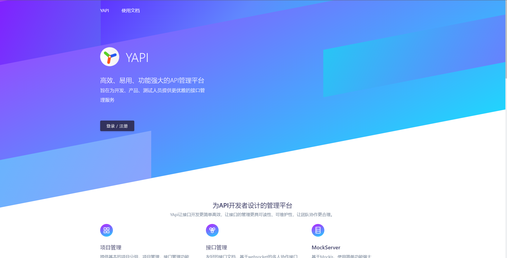

在 web 软件开发中，API接口管理非常重要，也是前后端对接的关键，这里分享一个非常好用且可以私有化部署的接口管理系统Yapi，对那些内网开发的小伙伴们是一个不错的选择。

## Yapi简介

Yapi 由 **YMFE** 开源，旨在为开发、产品、测试人员提供更优雅的接口管理服务，可以帮助开发者轻松创建、发布、维护 **API**

1. 权限管理

YApi 成熟的团队管理扁平化项目权限配置满足各类企业的需求

2. 可视化接口管理

基于 websocket 的多人协作接口编辑功能和类 postman 测试工具，让多人协作成倍提升开发效率

3. Mock Server

易用的 Mock Server，再也不用担心 mock 数据的生成了

4. 自动化测试

完善的接口自动化测试,保证数据的正确性

5. 数据导入

支持导入 swagger, postman, har 数据格式，方便迁移旧项目

6. 插件机制

强大的插件机制，满足各类业务需求

## Yapi使用Docker安装

由于内网开发环境，导致安装各种环境或者系统非常不方便，所以个人比较推荐通过docker来安装

1. 拉取镜像

`docker pull registry.cn-hangzhou.aliyuncs.com/anoy/yapi`

2. 创建挂载目录

`mkdir -p /data/yapi/mongodata`

3. 运行专用mongo（也可以放在已有的mongo）

`docker run -d --name yapimongo --restart always -v /data/yapi/mongodata:/data/db mongo`

4. 初始化 Yapi 数据库索引及管理员账号

`docker run -it --rm --link yapimongo:mongo --entrypoint npm --workdir /api/vendors registry.cn-hangzhou.aliyuncs.com/anoy/yapi run install-server`

`--rm：`在 Docker 容器退出时，默认容器内部的文件系统仍然被保留，以方便调试并保留用户数据。但是，对于 foreground 容器，由于其只是在开发调试过程中短期运行，其用户数据并无保留的必要，因而可以在容器启动时设置 **--rm** 选项，这样在容器退出时就能够自动清理容器内部的文件系统

`--entrypoint：`类似于 CMD 指令，但其不会被 docker run 的命令行参数指定的指令所覆盖，而且这些命令行参数会被当作参数送给 ENTRYPOINT 指令指定的程序。但是, 如果运行 docker run 时使用了 --entrypoint 选项，将覆盖 ENTRYPOINT 指令指定的程序

`--workdir：`指定工作目录。用 WORKDIR 指定的工作目录，会在构建镜像的每一层中都存在

`run：`用于执行后面跟着的命令行命令

5. 创建Yapi容器并启动

`docker run -d --name yapi --restart=always --link yapimongo:mongo --workdir /api/vendors  -p 3001:3000  registry.cn-hangzhou.aliyuncs.com/anoy/yapi  server/app.js`

`--link：`用于容器直接的互通

6. 使用Yapi

访问 `http://localhost:3000` 登录账号 `admin@admin.com`，密码 `ymfe.org`



7. Yapi配置

```bash
# 进入Yapi容器中
docker exec -it yapi /bin/bash
# 修改配置文件
vi ../config.json
# 修改内容如下
{
  "port": "3000",
  "adminAccount": "admin@admin.com",
  "closeRegister":true, # 配置禁用注册，主要是添加这句配置
  "db": { # 配置MongoDB
    "servername": "mongo",
    "DATABASE": "yapi",
    "port": 27017
  }
}
# 退出
exit
# 重启容器
docker restart yapi
```

> 本文参考：
>
> [docker安装yapi](https://www.cnblogs.com/binz/p/12684610.html)
>
> 具体使用可参考[官方教程](https://hellosean1025.github.io/yapi/documents/index.html)
